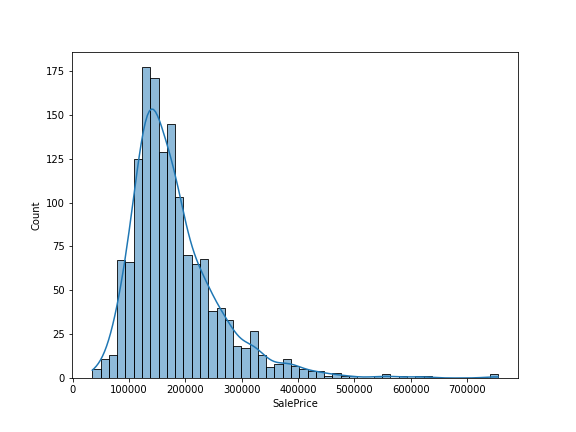
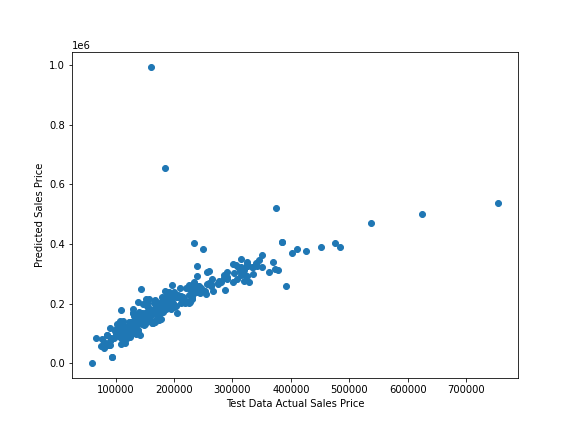
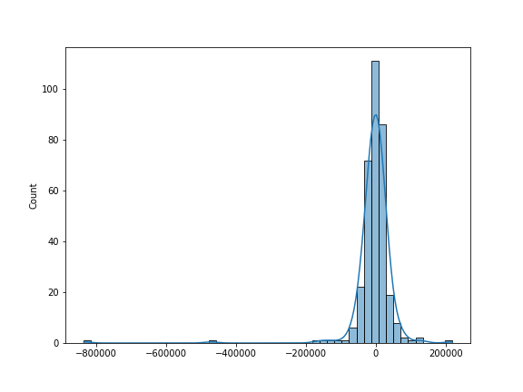
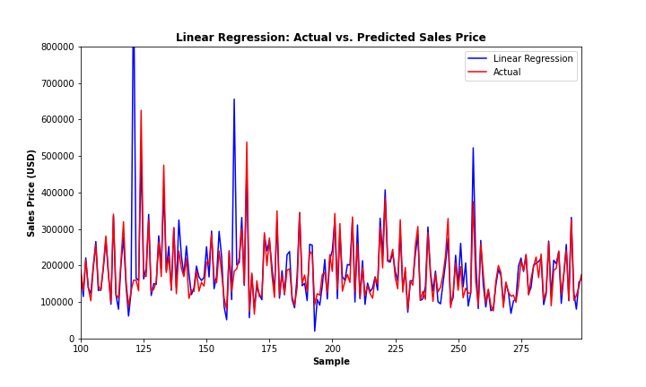

# Linear Regression

The linear regression (LR) model is a simple machine learning approach used for target variables that are continuous (i.e. variables that are real-valued). The LR model takes as its input both a vector of features (conventionally labeled **X**) and a vector of labels (**y**). Often different terminology is used —calling **X** our set of variables or predictors, and **y** our outcome or dependent variable—but the idea is the same. The data are plotted, and a straight line is then fit to these data points. The objective is to fit the line to the data points so that the distance between the line and points are minimized.

Let's return to our running house price-prediction example. Predicting sales price from the features is a regression problem, because sale price varies continuously. What we're trying to find is some optimal function that, given a matrix of feature scores, can produce a set of continuous values that best approximates (for whatever definition of "best" we like) the true house price of our houses.

First we import the required libraries then investigate the data:

```python
import pandas as pd
import numpy as np
import matplotlib.pyplot as plt
import seaborn as sns
%matplotlib inline

all_data = pd.read_csv('../data/house_prices.csv', sep=',', index_col=0).reset_index(drop=True)

all_data.info()
```

    <class 'pandas.core.frame.DataFrame'>
    RangeIndex: 1460 entries, 0 to 1459
    Data columns (total 80 columns):
    MSSubClass       1460 non-null int64
    MSZoning         1460 non-null object
    LotFrontage      1201 non-null float64
    LotArea          1460 non-null int64
    Street           1460 non-null object
    Alley            91 non-null object
    LotShape         1460 non-null object
    LandContour      1460 non-null object
    Utilities        1460 non-null object
    LotConfig        1460 non-null object
    LandSlope        1460 non-null object
    Neighborhood     1460 non-null object
    Condition1       1460 non-null object
    Condition2       1460 non-null object
    BldgType         1460 non-null object
    HouseStyle       1460 non-null object
    OverallQual      1460 non-null int64
    OverallCond      1460 non-null int64
    YearBuilt        1460 non-null int64
    YearRemodAdd     1460 non-null int64
    RoofStyle        1460 non-null object
    RoofMatl         1460 non-null object
    Exterior1st      1460 non-null object
    Exterior2nd      1460 non-null object
    MasVnrType       1452 non-null object
    MasVnrArea       1452 non-null float64
    ExterQual        1460 non-null object
    ExterCond        1460 non-null object
    Foundation       1460 non-null object
    BsmtQual         1423 non-null object
    BsmtCond         1423 non-null object
    BsmtExposure     1422 non-null object
    BsmtFinType1     1423 non-null object
    BsmtFinSF1       1460 non-null int64
    BsmtFinType2     1422 non-null object
    BsmtFinSF2       1460 non-null int64
    BsmtUnfSF        1460 non-null int64
    TotalBsmtSF      1460 non-null int64
    Heating          1460 non-null object
    HeatingQC        1460 non-null object
    CentralAir       1460 non-null object
    Electrical       1459 non-null object
    1stFlrSF         1460 non-null int64
    2ndFlrSF         1460 non-null int64
    LowQualFinSF     1460 non-null int64
    GrLivArea        1460 non-null int64
    BsmtFullBath     1460 non-null int64
    BsmtHalfBath     1460 non-null int64
    FullBath         1460 non-null int64
    HalfBath         1460 non-null int64
    BedroomAbvGr     1460 non-null int64
    KitchenAbvGr     1460 non-null int64
    KitchenQual      1460 non-null object
    TotRmsAbvGrd     1460 non-null int64
    Functional       1460 non-null object
    Fireplaces       1460 non-null int64
    FireplaceQu      770 non-null object
    GarageType       1379 non-null object
    GarageYrBlt      1379 non-null float64
    GarageFinish     1379 non-null object
    GarageCars       1460 non-null int64
    GarageArea       1460 non-null int64
    GarageQual       1379 non-null object
    GarageCond       1379 non-null object
    PavedDrive       1460 non-null object
    WoodDeckSF       1460 non-null int64
    OpenPorchSF      1460 non-null int64
    EnclosedPorch    1460 non-null int64
    3SsnPorch        1460 non-null int64
    ScreenPorch      1460 non-null int64
    PoolArea         1460 non-null int64
    PoolQC           7 non-null object
    Fence            281 non-null object
    MiscFeature      54 non-null object
    MiscVal          1460 non-null int64
    MoSold           1460 non-null int64
    YrSold           1460 non-null int64
    SaleType         1460 non-null object
    SaleCondition    1460 non-null object
    SalePrice        1460 non-null int64
    dtypes: float64(3), int64(34), object(43)
    memory usage: 912.6+ KB


```python
# Select only columns that are numeric
all_data = all_data.select_dtypes(['number'])

# Remove any rows that contain NaN
for ifeature in list(all_data):
    all_data = all_data[pd.notnull(all_data[ifeature])]

all_data.shape
```

	(1121, 37)

Let's also plot our target variable, Sales Price, to see what the distribution looks like:

```python
sns.histplot(all_data['SalePrice'], kde=True)
```

<center>
    <figure>
        
    </figure>
</center>


## Training a Linear Regression Model

We will need to first split up our data into an **X** array that contains the features to train on, and a **y** array with the target variable, in this case the Sale Price. We start by setting the X and y variables, split into train and test sets using the **train_test_split** function from **scikit-learn** and initialize the **LinearRegression** estimator:


```python
from sklearn.model_selection import train_test_split

# Set input features and output variable
y = all_data['SalePrice']
X = all_data.drop(['SalePrice'], axis =1)

# Split data into test and train sets
X_train, X_test, y_train, y_test = train_test_split(X, y.to_numpy().ravel(), test_size=0.30, random_state=101)

# OLS (and many other variants of regression) is housed in the linear_model module
from sklearn.linear_model import LinearRegression

# initialize the model
lr_model = LinearRegression()
```

The **LinearRegression** estimator, unlike many others, has very few configurable parameters. Above, we initialize it with all of the default values by passing no arguments to the function. Now we're ready to fit some data! We can do that by calling the **.fit()** method. This will be true for every **Estimator** in scikit-learn. We will use our training sub-datasets we created:


```python
# Fit the model
lr_model.fit(X_train, y_train);
```
Now we have a fitted model we need to evaluate the accuracy of this training process. We always want to evaluate the trained model prior to applying it to test data.

```python
# The sklearn convention is to denote fitted parameters with a trailing underscore
print('Model y intercept:',lr_model.intercept_,'\n')
print('Model feature coefficients:',lr_model.coef_,'\n')
```

    Model y intercept: -1348228.3926262031 
    
    Model feature coefficients: [-8.75772924e+01  5.95600326e+01  1.18930737e+00  1.38647884e+04
      4.91899261e+03  4.10628404e+02  1.81486446e+02  1.51819223e+01
      2.69056767e+01 -1.07411164e+00 -3.69107465e-01  2.54624576e+01
      1.84098928e+01  2.14677482e+01  7.35941390e+00  4.72370548e+01
     -8.14206679e+02 -6.09318362e+03 -1.52754837e+03 -1.82409326e+03
     -1.58292462e+04 -2.59304669e+04  5.44696494e+03 -4.36801780e+01
     -4.51893373e+01  4.11495671e+03  2.38219900e+01  4.82163185e+00
      2.38325092e+01  3.04386635e+01  9.87034508e+00  4.14229568e+01
      1.26489368e+02 -2.30107736e+00  2.62862323e+02  1.01150684e+02] 
    

We can use these parameter estimates (y intercept and coefficients) to manually construct and apply a prediction equation (i.e., $\hat{y} = -0.557 + 1.43x$) if we want to. The other thing we can look at is the coefficient.

```python
coeff_df = pd.DataFrame(lr_model.coef_,X.columns,columns=['Coefficient'])
coeff_df.head()
```

<table>
    <tr>
        <td></td>
        <td>Coefficient</td>
    </tr>
    <tr>
        <td>MSSubClass</td>
        <td>-87.577292</td>
    </tr>
    <tr>
        <td>LotFrontage</td>
        <td>59.560033</td>
    </tr>
    <tr>
        <td>LotArea</td>
        <td>1.189307</td>
    </tr>
    <tr>
        <td>OverallQual</td>
        <td>13864.788358</td>
    </tr>
    <tr>
        <td>OverallCond</td>
        <td>4918.992610</td>
    </tr>
</table>

Interpreting the coefficients:

- Holding all other features fixed, a 1 unit increase in **Lot Frontage** is associated with an **increase of \$59.56 **.
- Holding all other features fixed, a 1 unit increase in **Lot Area** is associated with an **increase of \$1.18 **.
- Holding all other features fixed, a 1 unit increase in **Overall Condition** is associated with an **increase of \$4918.99 **.

The next step is to use the trained model to predict new house Sale Price on new data. We do this by making use of the **.predict()** method that all **Estimator** classes implement. For example, here are the predicted scores for our **X** test data:


```python
lr_predictions = lr_model.predict(X_test)

plt.scatter(y_test,lr_predictions);
plt.xlabel('Test Data Actual Sales Price');
plt.ylabel('Predicted Sales Price');
```

<center>
    <figure>
        
    </figure>
</center>


We can also plot the residual:


```python
sns.histplot((y_test-lr_predictions),bins=50,kde=True);
```

<center>
    <figure>
        
    </figure>
</center>

Just to underscore how little we had to do, here's the whole example again, in three lines:


```python
# Initialize the linear regression estimator
lr_model = LinearRegression()

# Fit the model
lr_model.fit(X_train, y_train)

# Generate predictions
lr_predictions = lr_model.predict(X_test)
```

## Performance metrics

Once we've fit our model, it's natural to want to know how well it performs. In machine learning, the focus of model performance is on prediction; typically, we have some objective quantitative metric we care about, and to the degree that a model can produce better values on that metric, we incline to evaluate it more favorably. This doesn't mean that we have to single-mindedly base our evaluation of model on just one quantity; in practice, many other considerations may come into play (e.g., computational efficiency, interpretability, etc.). The point is mainly that machine learning practitioners—at least in applied settings—tend to care much more than traditional scientists do about what models can actually *do*, and much less about what's going on inside them.

### The coefficient of determination

For the rest of this tutorial, we're going to focus our attention on one particular metric of predictive performance: the coefficient of determination, or $R^2$. $R^2$ quantifies the proportion of variance in the outcome variable (e.g., house price) explained by the fitted model:

R-squared (R2) is the measure used to determine which line minimizes this distance:

<center>
<a href="https://www.codecogs.com/eqnedit.php?latex=R^{2}&space;=&space;\frac{Explained&space;variation}{Total&space;variation}" target="_blank"></a>
</center>

$R^2$ is the most widely used measure of performance in the individual differences literature, and we'll stick with tradition here. But this shouldn't be taken as an indication that there's anything particularly special about $R^2$. In fact, in many applications, it's a pretty bad metric, because it's defined with reference to the relative variation in a particular sample, and completely ignores the absolute deviation of predictions from the true scores (i.e., a model can have an $R^2$ of 1 while generating a predicted score distribution entirely outside the range of the true scores). For our purposes though, $R^2$ is a sensible metric, because for most individual differences variables, absolute scores don't really mean anything anyway—we're almost always interested in how variation across individuals relates to variation in some other measure or construct.

Here are three other common evaluation metrics for machine learning problems:

- **Mean Absolute Error** (MAE) is the mean of the absolute value of the errors:

$$\frac 1n\sum_{i=1}^n|y_i-\hat{y}_i|$$

- **Mean Squared Error** (MSE) is the mean of the squared errors:

$$\frac 1n\sum_{i=1}^n(y_i-\hat{y}_i)^2$$

- **Root Mean Squared Error** (RMSE) is the square root of the mean of the squared errors:

$$\sqrt{\frac 1n\sum_{i=1}^n(y_i-\hat{y}_i)^2}$$

Comparing these metrics:

- **MAE** is the easiest to understand, because it's the average error.
- **MSE** is more popular than MAE, because MSE "punishes" larger errors, which tends to be useful in the real world.
- **RMSE** is even more popular than MSE, because RMSE is interpretable in the "y" units.

All of these are **loss functions**, because we want to minimize them.

## How well did we do?

Let's see how well the linear regression model we fitted earlier (using the house features as predictors) explains the variance in sales price. We'll make use of scikit-learn's **metrics** module, which contains a large number of predefined performance metrics. As is true of **Estimator** objects, all metrics in scikit-learn follow the same usage pattern: we pass in the true scores and the model's predicted scores, respectively.


```python
# the metrics module contains predefined scoring functions
# for commonly used metrics like r^2, MSE, etc. 
from sklearn import metrics

# scoring functions are called by passing an array of
# true scores and and an array of predicted scores as
# inputs
print('Model score:', metrics.r2_score(y_test, lr_predictions))
print('MAE:', metrics.mean_absolute_error(y_test, lr_predictions))
print('MSE:', metrics.mean_squared_error(y_test, lr_predictions))
print('RMSE:', np.sqrt(metrics.mean_squared_error(y_test, lr_predictions)))
```

    Model score: 0.5238801531365112
    MAE: 26110.712069211004
    MSE: 3851956330.37256
    RMSE: 62064.130787215254


Looking at the $R^2$ score we get the amount of variance explained by the model, which means we can explain about 52% of the variance in sales price using 27 features of the home.

For convenience, scikit-learn estimators have a **.score()** method you can use as an alternative to the above. Instead of generating predicted scores and then explicitly feeding them to a metric function like **r2_score**, you can call **.score()** directly on the estimator after the **fit()** step, and the prediction will be done implicitly:


```python
# Initialize the estimator and fit the data, just like before
lr_model = LinearRegression()
lr_model.fit(X_train, y_train)
# Now instead of generating predictions explicitly,
# we just call .score(). Note that we lose the ability to
# specify the metric: LinearRegression.score() always uses
# the R^2 metric.
lr_model.score(X_test, y_test)
```

    0.5238801531365112


We can also look at how well we did visually by plotting the predicted vs. actual sales price values:

```python
range_plot = range(100,300)

fig, ax = plt.subplots(figsize=(10,6))
lr_1 = ax.plot(range_plot, lr_predictions[range_plot], color='blue', label='Linear Regression')
lr_2 = ax.plot(range_plot, y_test[range_plot], color='red', label = 'Actual')
ax.set_ylim(0, 800000)
ax.set_xlim(range_plot[0], range_plot[-1])
plt.title('Linear Regression: Actual vs. Predicted Sales Price', fontweight='bold')
plt.xlabel('Sample', fontweight='bold')
plt.ylabel('Sales Price (USD)', fontweight='bold')
plt.legend(handles=[lr_1[0],lr_2[0]])
plt.show()
```

<center>
    <figure>
        
    </figure>
</center>
