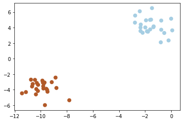

# Introduction

**Machine learning** is the field of science/engineering that seeks to build systems capable of learning from experience. This is a very broad definition, and in practice, the set of activities that get labeled "machine learning" is pretty heterogeneous. However, two elements are common to nearly all machine learning applications: (a) the emphasis is on developing algorithms that can learn (semi-)autonomously from data, rather than static rule-based systems that must be explicitly designed or updated by humans; and (b) algorithm evaluation focuses heavily on the ability to meet objective quantitative targets.

Fundamentally, machine learning involves building mathematical models to help understand data. "Learning" enters the fray when we give these models tunable parameters that can be adapted to observed data; in this way the program can be considered to be "learning" from the data. Once these models have been fit to previously seen data, they can be used to predict and understand aspects of newly observed data.

## Exploratory Data Analysis

In exploratory data analysis (EDA), a major component of the data science lifecycle, data is summarized, visualized, and transformed in order to understand it more deeply. Through exploratory data analysis we seek to deeply understand our data. Maintaining "a state of flexibility" helps us know what to look for. Fluency with our computational tools allows us to conduct our search. In this chapter, we emphasize the necessary attitude as we introduce increasingly sophisticated tools. Although EDA varies between domains of study, we almost always begin EDA by understanding:

1. The data types of columns and the granularity of rows in the dataset.
2. The distributions of quantitative data and measures of center and spread.
3. Relationships between quantities in the dataset.

## Machine Learning Categories

At the most fundamental level, machine learning can be categorized into two main types: supervised learning and unsupervised learning

### Supervised learning

Learning is supervised whenever we know the true values that our model is trying to predict, and hence, are in a position to "supervise" the learning process by quantifying prediction accuracy and making iterative adjustments.

Some examples of supervised learning problems:

* Determining whether or not incoming email is spam
* Predicting a person's age from personality scores
* Diagnosing schizophrenia based on genetic markers

Within the class of supervised learning problems, we can draw a further distinction between **classification** problems and **regression** problems. In both cases, the goal is to develop a predictive model that recovers the true labels as accurately as possible. The difference between the two lies in the nature of the labels: in classification, the labels are discrete; in regression, they're continuous.

For example, suppose someone hands us the following data:


```python
import matplotlib.pyplot as plt
# scikit-learn has some handy utilities for generating structure data
from sklearn.datasets import make_blobs

X, y = make_blobs(n_samples=50, centers=2,
                  random_state=1, cluster_std=1)
point_style = dict(cmap='Paired', s=len(X))
plt.scatter(*X.T,c=y, **point_style);
```

<center>
    <figure>
        
    </figure>
</center>


With supervised learning we are provided labels for the data so we can have an idea of what the difference between custers.

### Unsupervised learning

Learning is unsupervised when there's no ground truth or right answer, and the goal is just to learn some useful structure from the data. The learning algorithm receives no direct guidance about how well it's performing.

For example, suppose someone hands us the following data, with no further explanation and no labels:


```python
# scikit-learn has some handy utilities for generating structure data

X, y = make_blobs(n_samples=50, centers=2,
                  random_state=1, cluster_std=1)
plt.scatter(*X.T);
```

<center>
    <figure>
        
    </figure>
</center>

It would be natural to think that these data are generated from two distinct *clusters*. But since the data are unlabeled, we don't know for a fact that this assignment is correct; we're inferring the grouping in an unsupervised way, based on whatever principle are built into our estimation method (e.g., our visual system's tendency to group objects together based on proximity). The lack of access to the ground truth—and often, it's not even clear that there *is* any ground truth—underscores the difficulty of the unsupervised learning challenge.

### Classification

Now let's look at classification. In this case, the target labels we're trying to predict are discrete (or categorical). For example, building a model that takes a structural brain image as input and outputs a prediction about whether the brain belongs to a dog or a cat is a classification problem, because the output is discrete: each brain belongs to one of the two classes (or categories), and no brain ever takes on an an intermediate value (though our classifiers can certainly make a graded or probabilistic prediction about which class a brain belongs to).

In practice, we can often turn regression problems into classification problems by discretizing the data in some way. To make the point really clear, let's continue with the last plot within the unsupervised section. Here we have two-dimensional data: that is, we have two features for each point, represented by the (x,y) positions of the points on the plane. In addition, we have one of three class labels for each point, here represented by the colors of the points. From these features and labels, we would like to create a model that will let us decide whether a new point should be labeled color 1, color 2 or color 3.

There are a number of possible models for such a classification task, but here we will use an extremely simple one. We will make the assumption that the two groups can be separated by drawing a straight line through the plane between them, such that points on each side of the line fall in the same group. Here the model is a quantitative version of the statement "a straight line separates the classes", while the model parameters are the particular numbers describing the location and orientation of that line for our data. The optimal values for these model parameters are learned from the data (this is the "learning" in machine learning), which is often called training the model.


```python
import numpy as np
from sklearn.svm import SVC

X, y = make_blobs(n_samples=50, centers=2,
                  random_state=1, cluster_std=1)

# fit the support vector classifier model
clf = SVC(kernel='linear')
clf.fit(X, y)

# Get contours describing the model
xx = np.linspace(-12, 1, 10)
yy = np.linspace(-7, 7, 10)
xy1, xy2 = np.meshgrid(xx, yy)
Z = np.array([clf.decision_function([t])
              for t in zip(xy1.flat, xy2.flat)]).reshape(xy1.shape)

# plot points and model
fig, ax = plt.subplots(figsize=(8, 6));
line_style = dict(levels = [-1.0, 0.0, 1.0],
                  linestyles = ['dashed', 'solid', 'dashed'],
                  colors = 'gray', linewidths=1)
ax.scatter(X[:, 0], X[:, 1], c=y, **point_style);
ax.contour(xy1, xy2, Z, **line_style);
```

<center>
    <figure>
        
    </figure>
</center>

## Data Types

We often begin exploratory data analysis by examining the types of data that occur in a table. Although there are multiple ways of categorizing data types, in this book we discuss three broad types of data:

1. **Nominal data:** represents categories that do not have a natural ordering. For example: political party affiliation (Democrat, Republican, Other), sex (male, female, other), and computer operating system (Windows, MacOS, Linux).
2. **Ordinal data:** represents ordered categories. For example: T-shirt sizes (small, medium, large), Likert-scale responses (disagree, neutral, agree), and level of education (high school, college, graduate school). Ordinal and nominal data are considered subtypes of categorical data.
3. **Numerical data:** represents amounts or quantities. For example: heights, prices, and distances.

We refer to these types as statistical data types, or simply data types.
