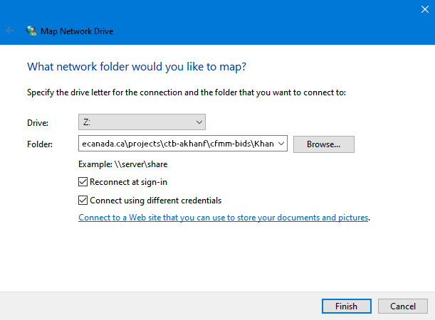
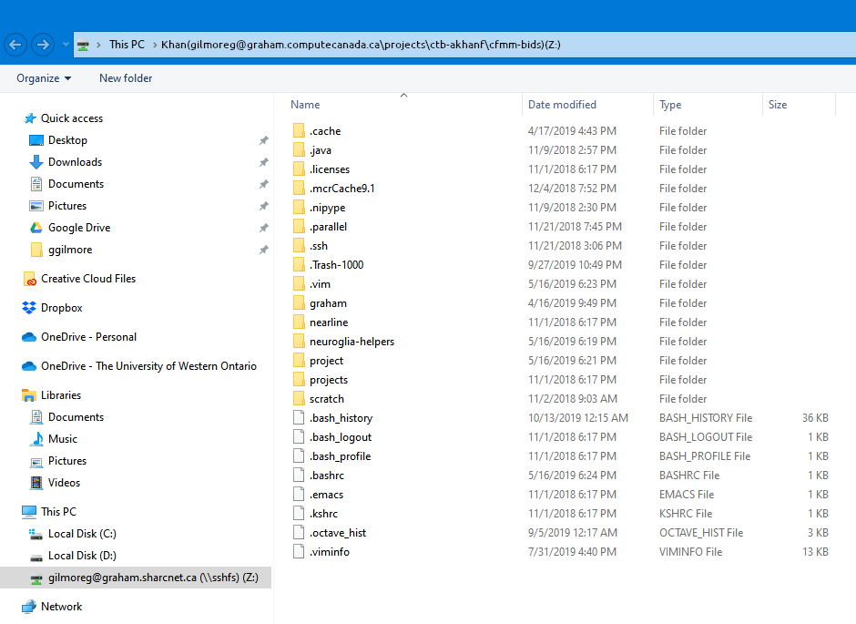

# Mount Remote Drive with SSHFS

1. Install the latest stable installer of [WinFSP](https://github.com/billziss-gh/winfsp/releases)

2. Install the latest stable installer of [SSHFS-Win](https://github.com/billziss-gh/sshfs-win/releases)

3. Open __File Explorer__, right-click on __This PC__ and choose __Map network drive__. Choose a drive to mount at and enter the following in the folder field (replace the options in ALL CAPS with the desired settings):

    ```console
    \\sshfs\REMUSER@HOST[\PATH]
    ```

    - `REMUSER` is the remote user (i.e. the user on the SSHFS host whose credentials are being used for access; `gilmoreg`).
    - `HOST` is the SSHFS host (i.e. `graham.computecanada.ca`).
    - `PATH` is the full remote path to the directory you want access to (i.e. \projects\ctb-akhanf\cfmm-bids\Khan)
    
    so the full command should look something like:

    ```console
    \\sshfs\gilmoreg@graham.computecanada.ca\projects\ctb-akhanf\cfmm-bids\Khan
    ```

4. Ensure you check the box __Connect using different credentials__ if your computer login password is different from the remote host. You may be asked to enter your password in a few times, ensure you select `remember my credentials` each time if you want to save your login.

    <p align="center"></p>

5. You should then see the network drive in your file explorer:

    <p align="center"></p>

