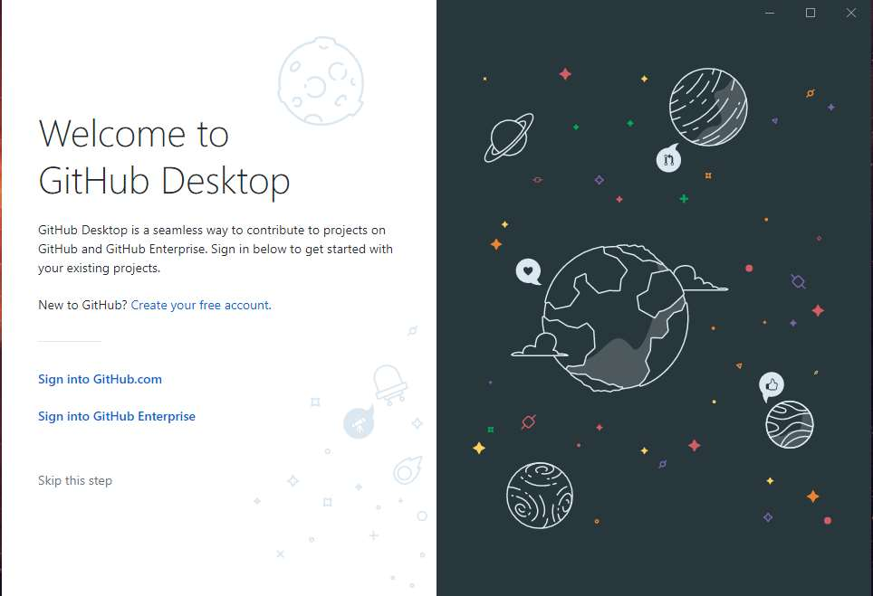
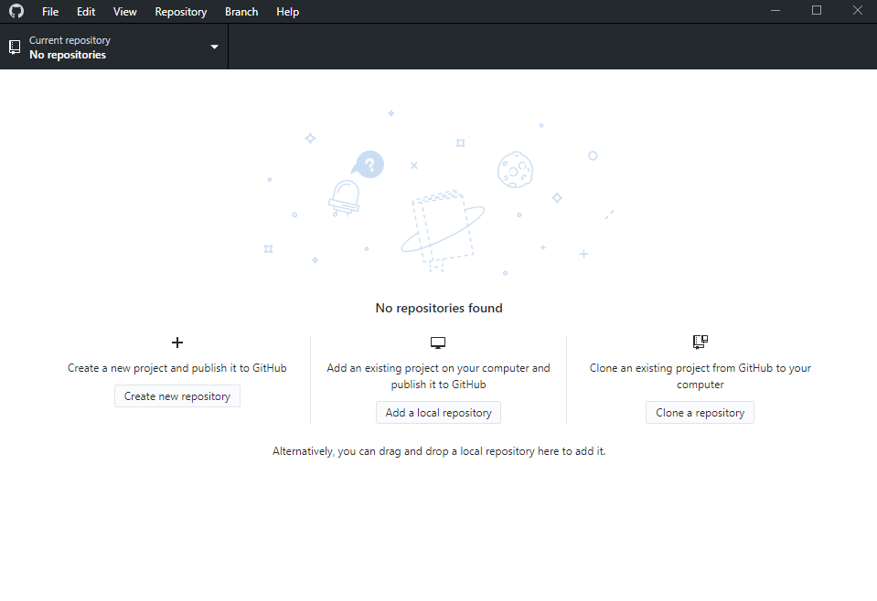

While working with Git is most often performed at the command line, it can often be daughnting for people who are not as comfortable with a terminal window. GitHub has made the entry point easier by introducing a user interface application - **GitHub Desktop**.

## Setting up GitHub Desktop

The first step to take is setting up an RSS feed so you are notified when a new article is published in an area you are interested in. The RSS manager I use is <a href="https://desktop.github.com/" target="_blank">Feedly</a>, which is simple and easy to use.

1. Install the application from the <a href="https://desktop.github.com/" target="_blank">official website</a>.

2. Once you have installed GitHub Desktop, launch it and sign in with your GitHub account:

    

3. Once you are signed in, choose **Clone a repository**.

    

