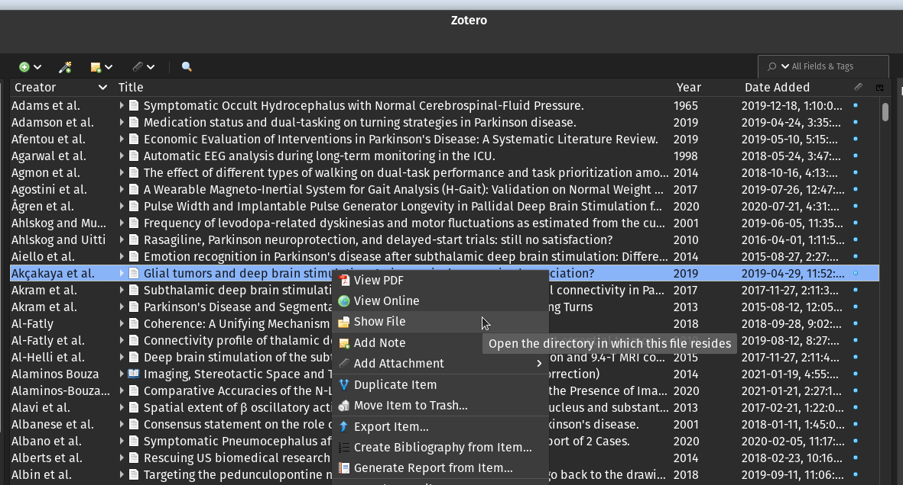

I make use of the advanced search feature in <a href="https://www.zotero.org/" target="_blank">Zotereo</a> frequently, which enables searching through manuscript PDFs. However, when you obtain manuscript PDF files from online databases, they may not be in a searchable format. This means you are unable to highlight and search for text within the PDF. I have written a small Python function that will recursively search though a directory and convert any found PDF to a searchable format.

Optical Character Recognition (OCR) is a method to enable text recognition within images and documents. PDFs contain vector graphics that can contain raster objects (.png, .jpg etc.). The OCR process will first rasterize each page of the PDF file then an OCR "layer" is created. 


## Getting Started

The code to perform the bulk OCR conversion can be found in this <a href="https://github.com/greydongilmore/ocr-pdf" target="_blank">GitHub repository</a>. Once you have the project repository stored locally, follow these steps to run OCR on your Zotereo database.

1. You will need to install the command-line program <a href="https://ocrmypdf.readthedocs.io/en/latest/installation.html" target="_blank">OCRmyPDF</a>.

2. Next, you will need to determine where Zotereo stores your PDF files. In Zotereo, right-click on any document and select **Show File**. A new window will pop-up, make note of the full path to parent directory (i.e. /home/Zotereo/storage).

    <center>
        <figure>
            
            <figcaption>Zotereo file storage location.</figcaption>
        </figure>
    </center>

3. In a terminal window, change into the GitHub project repository:

    ```console
    cd /home/user/Documents/Github/ocr-pdf
    ```

4. Install the required Python libraries by running:

    ```console
    python -m pip install -r requirements.txt
    ```

5. From the root of the repository, run the Python script by passing the full directory path determined in the first step:

    ```console
    python main.py -i "full/path/to/PDF/storage/directory"
    ```

This process will take some time. First, the algorithm will search through all the PDFs and determine which files are not searchable. Once the non-searchable PDF files have been found, the OCR process is executed using **ocrmypdf**.


