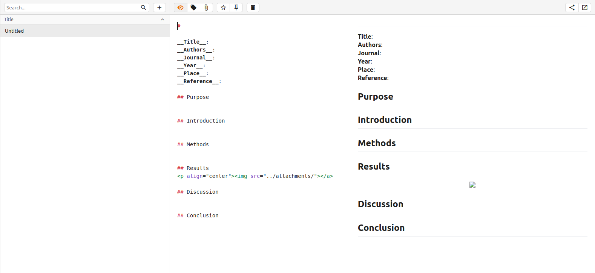

One frequently asked question amoung graduate students is "How do you organize/read manuscripts?". I have found a workflow that works quite well and allows me to stay ontop of the endless amount of new publications.

## Setup an RSS feed
---

The first step to take is setting up an RSS feed so you are notified when a new article is published in an area you are interested in. The RSS manager I use is <a href="https://feedly.com/i/welcome" target="_blank">Feedly</a>, which is simple and easy to use.

1. On the main page, select `Get started for free`. If you do not want to link your social media accounts, select `Continue with Feedly` and use an email address of your choice.
2. Once you have logged in you should see a search box for searching potential topics. Head over to <a href="https://www.ncbi.nlm.nih.gov/pubmed/" target="_blank">PubMed</a> and perform a common search you use to find articles you are interested in. I will use `deep brain stimulation` as an example.
3. Once you search for the term in PubMed you will notice an option to `Create RSS` underneath the search box. Click this option. Leave the default options set and click the **XML** link to open a new tab.

4. In the new tab, copy the full URL and paste it into the search box on the Feedly page and hit Enter. Once the search load click on the `Follow` tab, create a new feed for it and you will see it appear on the left side column.

You can now login and find all recent articles indexed on PubMed about the topic you are interested in. This is a great tool to use to keep up-to-date on publications.

## Take Notes
---

With any new article I come across, I try to make a quick summary note about it for later reference. A really nice tool for these notes is a software called <a href="https://notable.md/" target="_blank">Notable</a>. Notable is a Markdown based notetaking application that makes sharing notes very open and easy.

1. When you open Notable for the first time you will need to set your data directory. If you want to easily sync/share your notes, create a new Github repository and use that as your Notable data directory.
2. I created a template note for myself that I use for each new article I read, which looks like:

3. If you want the template you can download it [here](./static/Untitled.md).

